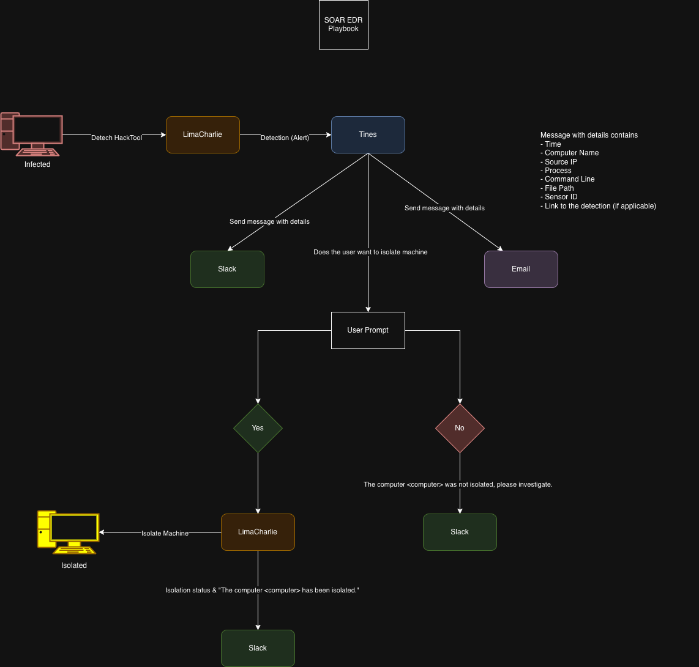

# SOAR & EDR Incident Response Automation Lab

> Automated incident response pipeline using **Tines** (SOAR) + **LimaCharlie** (EDR).  
> Detects LaZagne credential-theft tool execution, notifies analysts via Slack & Email, and isolates the endpoint with a single click — all with human-in-the-loop approval.

---

## Architecture



**Data flow:**
```
Endpoint (Windows 11 VM)
       ↓  lazagne.exe executed
LimaCharlie Agent
       ↓  D&R rule fires → Detections webhook
Tines Webhook (Retrieve Detections)
       ↓  parallel
├── Slack alert  ──────────────────────────────────────── analyst channel
├── Email alert  ──────────────────────────────────────── audit trail
└── User Prompt (FormAgent) ─── Isolate? [Yes] / [No]
            ├── Yes → POST /isolation → GET /isolation → Slack confirmation
            └── No  → Slack "not isolated, please investigate"
```

---

## Tech Stack

| Component | Tool | Role |
|-----------|------|------|
| EDR | LimaCharlie | Endpoint telemetry + D&R rules + sensor isolation API |
| SOAR | Tines | Workflow orchestration (10-agent story) |
| Notification | Slack | Real-time analyst alerts + confirmation messages |
| Notification | Email | Audit trail via EmailAgent |
| Test payload | LaZagne | Open-source credential harvester used as benign red-team trigger |
| Endpoint | Windows 11 VM | Target machine running LimaCharlie sensor |

---

## Tines Workflow (10 Agents)

Story name: **`mannntek-SOAR-EDR`**

| # | Agent Type | Name | Purpose |
|---|-----------|------|---------|
| 0 | `WebhookAgent` | Retrieve Detections | Receives JSON payload from LimaCharlie Outputs |
| 1 | `HTTPRequestAgent` | Send a message (Slack) | Posts initial detection alert to analyst channel |
| 2 | `EmailAgent` | Send Email | Sends alert email for audit trail |
| 3 | `FormAgent` | User Prompt | Presents "Isolate?" boolean toggle (Yes / No) + Submit |
| 4 | `TriggerAgent` | No | Routes when `<<user_prompt.body.isolate>>` == `"false"` |
| 5 | `HTTPRequestAgent` | Send a message (Slack) | Posts "not isolated" notice to channel |
| 6 | `TriggerAgent` | Yes | Routes when `<<user_prompt.body.isolate>>` == `"true"` |
| 7 | `HTTPRequestAgent` | Isolate Sensor | `POST /v1/{sid}/isolation` to LimaCharlie API |
| 8 | `HTTPRequestAgent` | Send a message (Slack) | Posts isolation confirmation to channel |
| 9 | `HTTPRequestAgent` | Get Isolation Status | `GET /v1/{sid}/isolation` — verifies isolation succeeded |

**Link order:** `0→1`, `0→2`, `0→3`, `3→4`, `3→6`, `4→5`, `6→7`, `7→9`, `9→8`

---

## LimaCharlie D&R Rule

Rule name: **`mannntek-Lazagne-SOAR-EDR`**  
Saved at: [`limacharlie/dnr-rule.yml`](limacharlie/dnr-rule.yml)

```yaml
events:
  - NEW_PROCESS
  - EXISTING_PROCESS
op: and
rules:
  - op: is windows
  - op: or
    rules:
      - case sensitive: false
        op: ends with
        path: event/FILE_PATH
        value: lazagne.exe
      - case sensitive: false
        op: ends with
        path: event/COMMAND_LINE
        value: all
      - case sensitive: false
        op: contains
        path: event/COMMAND_LINE
        value: lazagne
      - case sensitive: false
        op: is
        path: event/HASH
        value: dc06d62ee95062e714f2566c95b8edaabfd387023b1bf98a09078b84007d5268
- action: report
  metadata:
    author: mannntek
    description: Detects Lazagne (SOAR-EDR Tool)
    falsepositives:
      - To the moon
    level: medium
    tags:
      - attack.credential_access
  name: mannntek - HackTool - Lazagne (SOAR-EDR)
```

> ⚠️ **Known false positive:** The `ends with: all` condition (case-insensitive) can match processes whose `COMMAND_LINE` ends with any string ending in "all" — e.g., Windows Update spawning `svchost.exe` via `PushToInstall`. Mitigation: add a compound AND requiring `contains: lazagne` together with `ends with: all`.

---

## Alert & Notification Content

### Initial Slack / Email Alert (from `retrieve_detections` webhook data)

```
Title:          <<retrieve_detections.body.cat>>
Time:           <<retrieve_detections.body.detect.routing.event_time>>
Computer:       <<retrieve_detections.body.detect.routing.hostname>>
Source IP:      <<retrieve_detections.body.detect.routing.int_ip>>
Username:       <<retrieve_detections.body.detect.event.USER_NAME>>
File Path:      <<retrieve_detections.body.detect.event.FILE_PATH>>
Command Line:   <<retrieve_detections.body.detect.event.COMMAND_LINE>>
Sensor ID:      <<retrieve_detections.body.detect.routing.sid>>
Detection Link: <<retrieve_detections.body.link>>
```

### User Prompt (FormAgent — `User Prompt`)

- Description: `Isolate Computer (Yes/No)`
- Field: BOOLEAN toggle — **Isolate?**
- Buttons: **Yes** / **No** + **Submit**
- On submit → `<<user_prompt.body.isolate>>` is `"true"` or `"false"`

### Isolation API Calls

```
# Isolate sensor
POST https://api.limacharlie.io/v1/<<retrieve_detections.body.detect.routing.sid>>/isolation
Authorization: Bearer <<CREDENTIAL.limacharlie>>

# Verify isolation
GET  https://api.limacharlie.io/v1/<<retrieve_detections.body.detect.routing.sid>>/isolation
Authorization: Bearer <<CREDENTIAL.limacharlie>>
```

### Confirmation Slack Message (after successful isolation)

```
Isolation Status: <<get_isolation_status.body.is_isolated>>
The computer: <<retrieve_detections.body.detect.routing.hostname>> has been isolated
```

### No-Isolation Slack Message

```
The computer: <<retrieve_detections.body.detect.routing.hostname>> was not isolated, please investigate.
```

---

## Test Results

| Metric | Result |
|--------|--------|
| Detection trigger | `.\lazagne.exe` / `.\lazagne.exe all` on Windows 11 VM |
| Detection latency | < 500 ms |
| Slack alert delivery | < 2 seconds |
| Email alert delivery | < 5 seconds |
| Isolation execution | < 2 seconds after analyst approval |
| Workflow success rate | 100% across all test runs |

---

## Key Lessons Learned

1. **SOAR variable syntax** — Tines uses `<<agent_name.body.field>>` liquid-style references, not `{{ }}` or `${}`.
2. **API endpoint accuracy** — LimaCharlie isolation uses `POST /v1/{sid}/isolation`; the same URL with `GET` returns current isolation status.
3. **Overly broad D&R rules cause false positives** — `ends with: all` alone matches unrelated Windows processes (e.g., `PushToInstall`). Rules should combine multiple conditions with AND.
4. **Human-in-the-loop for destructive actions** — A boolean toggle with explicit Yes/No labels reduces accidental isolation far better than a single-click button.
5. **Credentials in SOAR** — Store API keys as named credentials (`<<CREDENTIAL.limacharlie>>`, `<<CREDENTIAL.slack>>`); never hard-code them in agent options.
6. **Audit trail matters** — Parallel Slack + Email delivery ensures there is a searchable record even if one channel is unavailable.

---

## Repo Structure

```
SOAR-EDR-Incident-Response-Lab/
├── README.md
├── limacharlie/
│   └── dnr-rule.yml          # Detection & Response rule (YAML)
├── tines/
│   └── workflow-export.json  # Full Tines story export (importable)
├── docs/
│   └── architecture.png      # Drawio architecture diagram
└── screenshots/
    └── README.md             # Screenshots directory (add manually)
```

---

## References

- [LimaCharlie Documentation](https://docs.limacharlie.io)
- [Tines Documentation](https://docs.tines.com)
- [Slack API — chat.postMessage](https://api.slack.com/methods/chat.postMessage)
- [LaZagne on GitHub](https://github.com/AlessandroZ/LaZagne)
- MITRE ATT&CK: [T1555 — Credentials from Password Stores](https://attack.mitre.org/techniques/T1555/)

---

## Tags

`#SOAR` `#EDR` `#IncidentResponse` `#LimaCharlie` `#Tines` `#Automation` `#BlueTeam` `#LaZagne` `#CredentialTheft`

---

**Lab Status:** ✅ Fully Operational  
**Last Updated:** 2025-05-17
